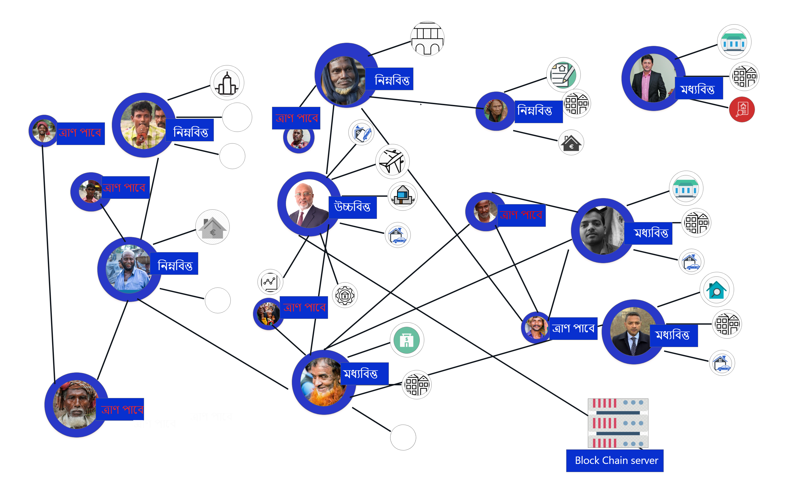
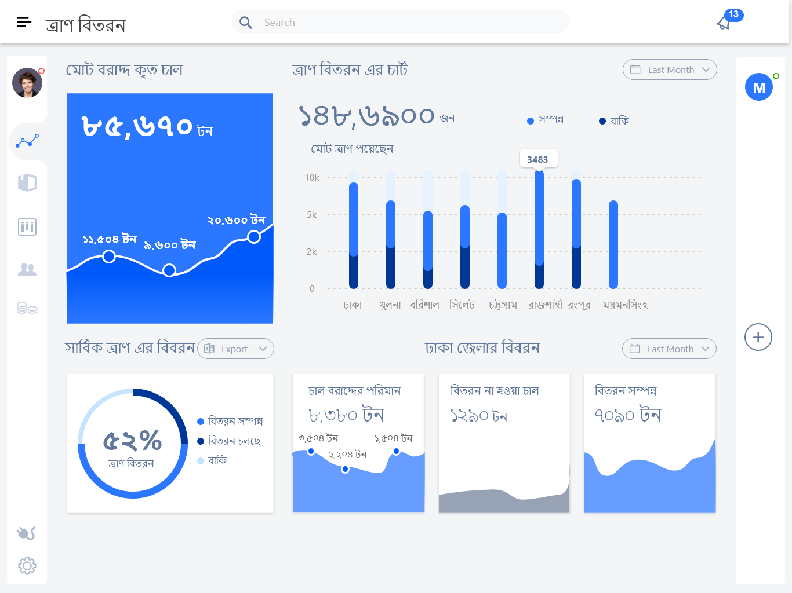

<h2 align="center"><b>Advanced Relief Distrubution System</b></h2>
<h4 align="center">Mobile application for Relif distribution.</h4>

 

"প্রত্যয়" 

 
  

<a href="#screenshots">Screenshots</a> &bull; <a href="#development">Discreptions</a> &bull;<a href="#feature">Features</a> &bull; <a href="#component">Component</a> &bull;  

## Blockchain poverty-stricken people identification

`>>>>>>There is no scope to identify how many people in Bangladesh are in vulnerable situations and if they are receiving support.`
 
 Solution: What if we make a blockchain relationship system. Where every node represents a people and line represent the family relationship between them. Also if we add all people's assets like house, car, filed or other assets in blockchain identity node than our intelligent system will find out which people are in poverty and who need relief. 

 data source
 ---
 * Every land/house/car/other valuable asset purchase and sale will be digitally stored in the blockchain. Sow we will know who wons what.
 * Every bank account asset amount will be added to the blockchain.
 * If anyone is an employee and gets monthly payment then this data will also be in the block.
 
 
 
 

Mobile App
---

`>>>A large portion of government aid is believed to be affected by corruption at the grassroots level.`

`>>>Some people in the city may get support multiple times, while others in the countryside are getting deprived.`

  &nbsp;  &nbsp;  
 &nbsp;  &nbsp; 
 &nbsp;  &nbsp; 
 &nbsp;   &nbsp;  
 &nbsp;  &emsp; 

Web Dashboard
---
  &nbsp; 

## Discreptions :

 Our solution is based upon a mobile app, website, and blockchain-based identity distribution. we try to solve the mismanagement of the relief distribution. With our mobile app, anyone can easily survey and register needy and poor people's identity with fingerprint or a QR code. When needy people take the relief they just need to verify his fingerprint on the Android phone. Then the app generates a QR code automatically. Next, the registration data will be sent to our database. As the amount of relief is given to the up chairman is known so we can get track of how the amount of rice/relief is given and or not. This will help to distribute relief without any corruption. Again a single person can't take twice the relief. 

## Features :

* QR code scan
* Finger print scan
* Web app dashboard
* Details of relief distrubution
* Central database sync

## Component :

- NavigationView  
- CoordinatorLayout  
- AppBarLayout  
- CollapsingToolbarLayout  
- NestedScrollView  
- TabLayout  
- FloatingActionButton  
- SnackBar  
- SwipeRefreshLayout  
- RecyclerView  
- CardView  
- TextInputLayout  
- BottomSheetDialog  
- SharedElementTransitions  
- BottomNavigationView  
- Adaptive icon  
- App shortcuts 
  
---  

